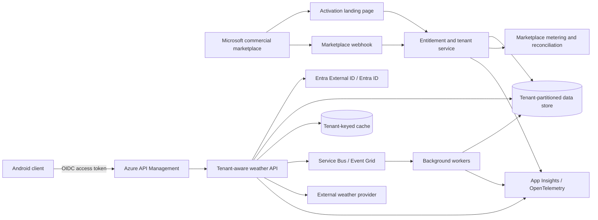

# SaaS Readiness Assessment: CuteWeather

**Repository:** [`vitaviva/compose-weather`](https://github.com/vitaviva/compose-weather)  
**Assessment date:** 28 August 2026  
**Revision assessed:** [`f05674aed9b461f7a8ea9a067a244064cbfa3c53`](https://github.com/vitaviva/compose-weather/tree/f05674aed9b461f7a8ea9a067a244064cbfa3c53)  
**Overall SaaS readiness:** **5/100 - not SaaS-ready**

## Executive assessment

CuteWeather is a polished, single-user Android UI demonstration, not a SaaS product. The repository contains no backend, network access, live weather integration, identity, persistence, tenancy, billing, Azure infrastructure, deployment automation, or commercial marketplace integration. Its weather data is compiled-in mock data.

Becoming SaaS-ready would therefore be a **greenfield platform build that reuses selected mobile UI assets**, not a conventional production-hardening exercise. The strongest reusable assets are the Compose interface, Apache-2.0 licensing baseline, and a narrow Android CI workflow.

The repository is also materially stale: GitHub metadata shows no commits since 26 March 2021, no releases, and a pre-1.0 Compose-era toolchain. It is not archived, but it should not be treated as an actively maintained product.

## Method and scoring

Scores reflect only verifiable implementation at the assessed revision:

| Score | Meaning |
|---:|---|
| 0 | Absent, or no applicable implementation evidence |
| 1 | Concept only or almost entirely absent |
| 2 | Early/partial implementation |
| 3 | Functional baseline with material gaps |
| 4 | Production-capable with minor gaps |
| 5 | Mature and optimized |

“Not evidenced” does not prove that an external organization has no process; it means the repository contains no assessable implementation or documentation. No credit is awarded for hypothetical future capability.

## Evidence baseline

| Evidence | Finding |
|---|---|
| [Repository tree](https://github.com/vitaviva/compose-weather/tree/f05674aed9b461f7a8ea9a067a244064cbfa3c53) | Android Gradle application only; no backend, API, container, infrastructure-as-code, or cloud deployment assets. |
| [`README.md`](https://github.com/vitaviva/compose-weather/blob/f05674aed9b461f7a8ea9a067a244064cbfa3c53/README.md) | Presents a weather UI challenge/demo, not a commercial service. |
| [`app/build.gradle`](https://github.com/vitaviva/compose-weather/blob/f05674aed9b461f7a8ea9a067a244064cbfa3c53/app/build.gradle#L1-L67) | AndroidX/Compose dependencies only; no HTTP client, persistence, authentication, billing, telemetry, or Azure SDK. |
| [`AndroidManifest.xml`](https://github.com/vitaviva/compose-weather/blob/f05674aed9b461f7a8ea9a067a244064cbfa3c53/app/src/main/AndroidManifest.xml#L1-L31) | No `INTERNET` permission; one activity and no service components. |
| [`MainActivity.kt`](https://github.com/vitaviva/compose-weather/blob/f05674aed9b461f7a8ea9a067a244064cbfa3c53/app/src/main/java/com/github/cuteweather/MainActivity.kt#L1-L52) | Single Compose activity without repository, dependency injection, identity, or service layer. |
| [`data/Mock.kt`](https://github.com/vitaviva/compose-weather/blob/f05674aed9b461f7a8ea9a067a244064cbfa3c53/app/src/main/java/com/github/cuteweather/data/Mock.kt) | Weather records are hardcoded Kotlin literals; no live source or persistence. |
| [`Check.yaml`](https://github.com/vitaviva/compose-weather/blob/f05674aed9b461f7a8ea9a067a244064cbfa3c53/.github/workflows/Check.yaml#L1-L58) | Build, formatting, lint, and device tests exist; no release, signing, deployment, environment promotion, or security scanning. |
| [`.github`](https://github.com/vitaviva/compose-weather/tree/f05674aed9b461f7a8ea9a067a244064cbfa3c53/.github) | No Dependabot, CodeQL, `SECURITY.md`, `CODEOWNERS`, or operational templates. |
| [`LICENSE`](https://github.com/vitaviva/compose-weather/blob/f05674aed9b461f7a8ea9a067a244064cbfa3c53/LICENSE) | Apache-2.0 baseline; commercialization still requires an IP/attribution review. |
| [GitHub metadata](https://api.github.com/repos/vitaviva/compose-weather) | Created and last pushed in March 2021; forked from Google’s Android challenge template. |
| [Releases](https://github.com/vitaviva/compose-weather/releases) | No published releases or versioned production artifacts. |

## Framework scorecard

| Reference area | Score | Confidence | Assessment |
|---|---:|---|---|
| Azure multitenant architecture | **0/5** | High | No customer, account, organization, tenant identifier, tenant-context propagation, isolation model, deployment stamp, placement policy, or noisy-neighbor control. |
| CAF ISV landing zone foundation | **0/5** | High | No Azure hierarchy, subscription model, RBAC, policy, tagging, networking, security baseline, monitoring, IaC, or environment promotion. |
| Commercial Marketplace SaaS Accelerator | **0/5** | High | No landing page, webhook, fulfillment, metering, entitlement, or accelerator component. |
| Tenant isolation model | **0/5** | High | Compute, data, identity, messaging, and network isolation are all undefined because no SaaS platform exists. |
| Tenant lifecycle automation | **0/5** | High | No signup, activation, provisioning, entitlement, plan change, suspension, migration, retention, deletion, or reconciliation workflow. |
| Fulfillment and metering | **0/5** | High | No Marketplace Fulfillment API v2 integration, metering dimensions, idempotency, reconciliation, or audit ledger. |
| Security and compliance | **1/5** | Medium | Apache-2.0 and contribution text exist. No product identity, authorization, secrets lifecycle, data controls, threat model, isolation tests, vulnerability automation, privacy material, or compliance evidence. |
| Scale and SRE | **0/5** | High | No hosted runtime, SLOs, telemetry, alerting, capacity model, quotas, backup, DR, incident response, or tenant-aware cost attribution. |
| Marketplace offer-type fit | **0/5** | High | Current APK is not packageable as an Azure SaaS, Managed Application, Container, or VM offer. |
| Marketplace onboarding | **0/5** | High | No Partner Center readiness, offer metadata, plans, pricing, legal artifacts, technical validation, support model, or launch process. |
| Backend/API | **0/5** | High | No backend or API exists. |
| Identity and access | **0/5** | High | No user identity, authentication, authorization, or service identity. |
| Persistence and data management | **0/5** | High | All weather data is compiled-in; no database, cache, retention, residency, backup, or deletion controls. |
| Billing and entitlement | **0/5** | High | No payment, subscription, plan, entitlement, or usage model. |
| Administration and support | **0/5** | High | No operator/admin console, customer support workflow, audit view, or tenant management surface. |
| CI/CD and testing | **2/5** | High | Useful Android CI checks exist, but no CD, signed release, security testing, backend tests, production gates, or environment promotion. |
| Documentation and licensing | **2/5** | High | README, contribution guide, and Apache-2.0 license provide OSS-demo hygiene; product, architecture, API, security, operations, and commercial documentation are absent. |

## Azure Well-Architected Framework

| Pillar | Score | Assessment |
|---|---:|---|
| Reliability | **1/5** | Android build and device-test checks provide a narrow quality signal. There is no hosted service, availability design, health model, backup, recovery, or SLA. |
| Security | **1/5** | Local-only design limits current remote attack surface, but there is no SaaS identity, authorization, tenant isolation, secrets management, dependency scanning, or security response process. |
| Cost Optimization | **0/5** | No cloud resources, cost model, budgets, unit economics, metering, or tenant cost attribution exist. |
| Operational Excellence | **1/5** | Formatting, linting, builds, and instrumentation tests are automated. IaC, deployment, observability, runbooks, release management, and incident operations are absent. |
| Performance Efficiency | **1/5** | Compose UI exists, but no profiling evidence or scalable service architecture can be assessed. |

**WAF average:** **0.8/5**

## Weighted readiness result

| Category | Weight | Score | Contribution |
|---|---:|---:|---:|
| Multitenancy and isolation | 12% | 0.0/5 | 0.0 |
| CAF ISV landing zone | 8% | 0.0/5 | 0.0 |
| SaaS Accelerator alignment | 8% | 0.0/5 | 0.0 |
| Tenant lifecycle | 8% | 0.0/5 | 0.0 |
| Fulfillment and metering | 10% | 0.0/5 | 0.0 |
| Security and compliance | 10% | 1.0/5 | 2.0 |
| Scale and SRE | 8% | 0.0/5 | 0.0 |
| Offer fit and onboarding | 12% | 0.0/5 | 0.0 |
| WAF pillars | 10% | 0.8/5 | 1.6 |
| Core SaaS capabilities | 10% | 0.0/5 | 0.0 |
| CI/CD and testing | 2% | 2.0/5 | 0.8 |
| Documentation and licensing | 2% | 2.0/5 | 0.8 |
| **Total** | **100%** |  | **5.2/100** |

**Reported score: 5/100.** This is a SaaS-readiness score, not a judgment of the app as a visual Compose sample.

## Marketplace offer-type fit

| Offer type | Fit | Required change |
|---|---:|---|
| Transactable SaaS | **0/5** | Build a hosted multitenant service, activation landing page, fulfillment webhook, entitlement store, and optional metering service. |
| Azure Managed Application | **0/5** | Build an Azure-deployed solution and provide ARM/Bicep packaging plus the required managed-application UX and operating model. |
| Azure Container | **0/5** | Build a server workload and supported container packaging; an Android APK is not a container offer. |
| Azure VM | **0/5** | Build and certify a supported VM image; no applicable workload currently exists. |
| Managed Service | **0/5** | Define an Azure Lighthouse-based managed service and operational scope; unrelated to the current application. |
| Mobile app store | **2/5** | This is the natural current distribution family, but live data, modern dependencies, production signing, privacy material, and a release process are still required. |

If commercialization is pursued, a **transactable SaaS offer with an Android companion client** is the most coherent Azure Marketplace path. It is still a new product architecture rather than packaging the current repository.

## Priority blockers

### P0 - product viability

1. **No live product service:** Build a weather-provider integration, backend API, persistence layer, and network-enabled mobile repository layer.
2. **No identity or tenant boundary:** Define the paying customer, user-to-tenant mapping, authentication, authorization, and trusted tenant-context propagation.
3. **No multitenant isolation:** Implement and test isolation across data, compute, cache, messaging, logs, search, and administrative tools.
4. **No commercial lifecycle:** Add tenant activation, entitlement, plan management, suspension, offboarding, Fulfillment API, and metering/reconciliation.

### P1 - production readiness

1. Modernize Kotlin, Android Gradle Plugin, Compose, Gradle, and dependent libraries.
2. Establish an Azure landing zone, infrastructure-as-code, dev/test/prod promotion, deployment gates, and rollback.
3. Add secure engineering controls: dependency and code scanning, secret management, threat modeling, privacy/data policies, and vulnerability response.
4. Add observability, SLOs, alerting, on-call, backup/restore, disaster recovery, capacity controls, and tenant-aware operational dashboards.
5. Build administration, support, audit, and customer-success capabilities.

### P2 - commercial maturity

1. Resolve IP provenance and attribution inherited from the Android challenge template before commercialization.
2. Establish semantic versioning, release notes, signed artifacts, support policy, SLA, terms of use, privacy policy, and pricing.
3. Complete Partner Center setup, private preview, certification remediation, financial reconciliation, and launch operations.

## Recommended target architecture

**Tenant definition:** A tenant should be one paying customer account. Users, subscriptions, business units, environments, and Marketplace purchases must map explicitly to that tenant. For a consumer-only weather app, Azure Marketplace SaaS may not be the right channel; validate that a business customer and paid SaaS value proposition exist before building.

**Recommended initial model:** pooled multitenant compute with logically isolated data, per-tenant authorization and quotas, and a path to dedicated deployment stamps for regulated or high-volume enterprise tenants.

### Multitenancy decision record

| Dimension | Recommended decision | Required control |
|---|---|---|
| Business boundary | Tenant = paying customer account | Authoritative mapping among identity, Marketplace subscription, plan, and internal tenant ID |
| Compute | Shared stateless API and workers initially | Per-tenant quotas, throttling, load tests, tenant-safe caches, and deployment-stamp thresholds |
| Data | Shared service with tenant partitioning initially | Server-derived tenant filters on every query; deny cross-tenant access by default; automated horizontal-privilege tests |
| Identity | Entra External ID for customers; managed identities for services | Derive tenant context from authenticated identity and entitlement data; never trust a client-supplied tenant ID |
| Messaging | Shared namespace, tenant context in signed/validated message envelope | Validate producer authorization, partition safely, preserve context through retries and dead-letter processing |
| Networking | Shared edge with private service dependencies | WAF, API Management rate limits, private endpoints where justified, controlled egress to weather providers |
| Placement | Tenant-to-stamp registry | Capacity, geography, compliance, and tier-based placement with auditable migration workflows |
| Enterprise evolution | Hybrid pooled/silo model | Dedicated stamps only where compliance, performance, or commercial tier justifies added cost |

## Tenant lifecycle and commercial flow

Use an idempotent state machine:

`Purchased -> PendingActivation -> Provisioning -> Active -> ChangingPlan | Suspended -> Offboarding -> Retained -> Deleted`

Every transition should have a durable operation ID, retries, compensation behavior, audit record, and reconciliation job. Marketplace webhook delivery must not be treated as the sole source of truth. Regularly reconcile Marketplace subscription state, internal entitlement, metering ledger, and deployed tenant resources.

Suggested metering dimensions, if a metered plan is commercially justified:

- API requests above the included allowance
- Premium forecast locations
- Historical-data units
- Enterprise dedicated-capacity units

Usage reporting must be idempotent, timestamp-valid, auditable, and reconciled against accepted/rejected Marketplace events.

## Marketplace go-live gates

| Gate | Current | Exit criterion |
|---|---|---|
| Product and offer fit | **Blocked** | Defined business customer, differentiated SaaS value, plans, pricing, support, and unit economics |
| Tenant architecture | **Blocked** | Approved tenant model, context propagation, isolation map, placement policy, and migration path |
| Identity and security | **Blocked** | Production authentication/authorization, managed identity, Key Vault, threat model, isolation tests, and security response |
| Fulfillment | **Blocked** | Resolve/activate/update/cancel flows and webhook processing pass end-to-end certification tests |
| Metering and finance | **Blocked** | Dimensions, usage ledger, idempotency, retries, reconciliation, and finance exception process are operational |
| Reliability and operations | **Blocked** | SLIs/SLOs, telemetry, alerting, runbooks, backup/restore, DR exercise, capacity plan, and incident ownership |
| Delivery | **Blocked** | IaC, dev/test/prod, security gates, signed releases, progressive deployment, rollback, and change evidence |
| Compliance and legal | **Blocked** | IP review, privacy notice, terms, data handling/retention, subprocessors, accessibility, and support/SLA artifacts |
| Partner Center publication | **Blocked** | Publisher account, roles, offer metadata, plans, preview audience, technical configuration, validation, and certification |

## Day-2 SRE control plan

- Define platform and tenant-level availability, latency, correctness, freshness, and activation SLOs with error budgets.
- Tag every trace, metric, audit event, usage event, and cost allocation with a non-sensitive internal tenant key; prevent tenant data leakage in logs.
- Enforce per-tenant API quotas, concurrency limits, provider-call budgets, cache partitions, and circuit breakers.
- Track deployment-stamp capacity, tenant density, hot partitions, weather-provider quotas, cost per active tenant, and blast radius.
- Operate runbooks for provider outage, stale forecast data, authentication failure, webhook backlog, metering rejection, cross-tenant access alert, tenant migration, and regional recovery.
- Test backup restoration, regional failover, tenant movement, entitlement reconciliation, and cross-tenant isolation continuously.

## Phased roadmap

| Phase | Indicative outcome |
|---|---|
| 0. Product validation | Confirm B2B SaaS customer, paid value proposition, data-provider licensing, offer channel, tenancy definition, and unit economics. |
| 1. Engineering foundation | Modernize Android stack; establish CAF ISV landing zone, IaC, identity, governance, networking, monitoring, and dev/test/prod delivery. |
| 2. Core service | Build live weather ingestion, tenant-aware API, persistence/cache, mobile repository layer, authorization, and isolation tests. |
| 3. Tenant operations | Add activation, provisioning, configuration, plan changes, placement, migration, suspension, retention, deletion, and reconciliation. |
| 4. Marketplace | Adopt SaaS Accelerator patterns; integrate fulfillment, webhooks, entitlement, metering, financial reconciliation, and Partner Center plans. |
| 5. Production hardening | Complete security/compliance controls, observability, SLOs, quotas, backup/DR, support/admin tooling, load tests, and incident readiness. |
| 6. Launch | Private preview, certification, operational acceptance, pricing validation, public launch, and ongoing evidence collection. |

## Assumptions and limitations

- Assessment is repository-based and does not claim that the owner has no external systems or organizational controls.
- No private infrastructure, Partner Center configuration, mobile-store listing, or unpublished service was available for review.
- The default branch and public metadata were assessed at the stated revision; no releases were available.
- “Absent” is used where code and repository-wide artifact searches confirmed no relevant implementation. “Not evidenced” is used for external business or organizational processes.
- Roadmap durations are intentionally omitted because product scope, team size, compliance targets, data-provider terms, regions, and expected tenant scale are unknown.

## Reference frameworks

- [Architect multitenant solutions on Azure](https://learn.microsoft.com/en-us/azure/architecture/guide/multitenant/overview)
- [Multitenant tenancy models](https://learn.microsoft.com/en-us/azure/architecture/guide/multitenant/considerations/tenancy-models)
- [Multitenant architectural approaches](https://learn.microsoft.com/en-us/azure/architecture/guide/multitenant/approaches/overview)
- [Deployment Stamp pattern](https://learn.microsoft.com/en-us/azure/architecture/patterns/deployment-stamp/)
- [Noisy Neighbor antipattern](https://learn.microsoft.com/en-us/azure/architecture/antipatterns/noisy-neighbor/noisy-neighbor)
- [CAF ISV landing zone](https://learn.microsoft.com/en-us/azure/cloud-adoption-framework/ready/landing-zone/isv-landing-zone)
- [Azure Well-Architected Framework](https://learn.microsoft.com/en-us/azure/architecture/framework/)
- [Commercial Marketplace SaaS Accelerator](https://github.com/Azure/Commercial-Marketplace-SaaS-Accelerator)
- [SaaS Fulfillment APIs](https://learn.microsoft.com/en-us/partner-center/marketplace-offers/pc-saas-fulfillment-apis)
- [SaaS Fulfillment Subscription API v2](https://learn.microsoft.com/en-us/partner-center/marketplace-offers/pc-saas-fulfillment-subscription-api)
- [Marketplace Metering Service APIs](https://learn.microsoft.com/en-us/partner-center/marketplace-offers/marketplace-metering-service-apis)
- [Metered billing for SaaS offers](https://learn.microsoft.com/en-us/partner-center/marketplace-offers/saas-metered-billing)

